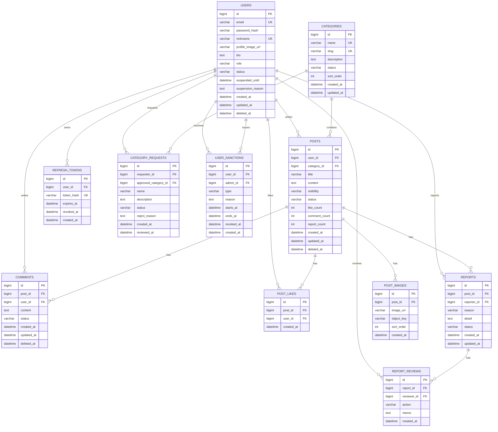

# 램그스타인 ERD

## 1. ERD

## 2. 테이블 설명

### USERS

회원 정보.

| 컬럼 | 타입 | 설명 |
| --- | --- | --- |
| id | bigint | 회원 ID |
| email | varchar | 로그인 이메일, 유니크 |
| password_hash | varchar | 해시된 비밀번호 |
| nickname | varchar | 닉네임, 유니크 |
| profile_image_url | varchar | 프로필 이미지 URL |
| bio | text | 자기소개 |
| role | varchar | USER, ADMIN |
| status | varchar | ACTIVE, TEMP_SUSPENDED, PERMANENT_SUSPENDED, DELETED |
| suspended_until | datetime | 일시정지 만료일 |
| suspension_reason | text | 현재 정지 사유 |
| created_at | datetime | 생성일 |
| updated_at | datetime | 수정일 |
| deleted_at | datetime | 탈퇴/삭제일 |

### REFRESH_TOKENS

JWT Refresh Token 저장소. 원문 토큰은 저장하지 않고 해시만 저장한다.

| 컬럼 | 타입 | 설명 |
| --- | --- | --- |
| id | bigint | 토큰 ID |
| user_id | bigint | 회원 ID |
| token_hash | varchar | Refresh Token 해시 |
| expires_at | datetime | 만료일 |
| revoked_at | datetime | 폐기일 |
| created_at | datetime | 생성일 |

### CATEGORIES

게시판 카테고리. 전체 게시판은 별도 데이터가 아니라 카테고리 필터 없이 조회한다. 인기 게시판도 별도 데이터가 아니라 정렬 기준으로 조회한다.

| 컬럼 | 타입 | 설명 |
| --- | --- | --- |
| id | bigint | 카테고리 ID |
| name | varchar | 카테고리 이름 |
| slug | varchar | URL용 식별자 |
| description | text | 설명 |
| status | varchar | ACTIVE, INACTIVE |
| sort_order | int | 표시 순서 |
| created_at | datetime | 생성일 |
| updated_at | datetime | 수정일 |

### CATEGORY_REQUESTS

사용자 카테고리 추가 신청.

| 컬럼 | 타입 | 설명 |
| --- | --- | --- |
| id | bigint | 신청 ID |
| requester_id | bigint | 신청자 ID |
| approved_category_id | bigint | 승인 후 생성된 카테고리 ID |
| name | varchar | 신청 카테고리 이름 |
| description | text | 신청 사유/설명 |
| status | varchar | PENDING, APPROVED, REJECTED |
| reject_reason | text | 반려 사유 |
| created_at | datetime | 신청일 |
| reviewed_at | datetime | 검토일 |

### POSTS

실패담 게시글.

| 컬럼 | 타입 | 설명 |
| --- | --- | --- |
| id | bigint | 게시글 ID |
| user_id | bigint | 작성자 ID |
| category_id | bigint | 카테고리 ID |
| title | varchar | 제목 |
| content | text | 본문 |
| visibility | varchar | PUBLIC, PRIVATE |
| status | varchar | PUBLISHED, HIDDEN, DELETED |
| like_count | int | 좋아요 수 캐시 |
| comment_count | int | 댓글 수 캐시 |
| report_count | int | 신고 수 캐시 |
| created_at | datetime | 생성일 |
| updated_at | datetime | 수정일 |
| deleted_at | datetime | 삭제일 |

### POST_IMAGES

게시글 이미지.

| 컬럼 | 타입 | 설명 |
| --- | --- | --- |
| id | bigint | 이미지 ID |
| post_id | bigint | 게시글 ID |
| image_url | varchar | 이미지 URL |
| object_key | varchar | S3 object key |
| sort_order | int | 표시 순서 |
| created_at | datetime | 생성일 |

### POST_LIKES

게시글 좋아요.

| 컬럼 | 타입 | 설명 |
| --- | --- | --- |
| id | bigint | 좋아요 ID |
| post_id | bigint | 게시글 ID |
| user_id | bigint | 회원 ID |
| created_at | datetime | 생성일 |

제약:

- UNIQUE(post_id, user_id)

### COMMENTS

댓글.

| 컬럼 | 타입 | 설명 |
| --- | --- | --- |
| id | bigint | 댓글 ID |
| post_id | bigint | 게시글 ID |
| user_id | bigint | 작성자 ID |
| content | text | 댓글 내용 |
| status | varchar | PUBLISHED, HIDDEN, DELETED |
| created_at | datetime | 생성일 |
| updated_at | datetime | 수정일 |
| deleted_at | datetime | 삭제일 |

### REPORTS

게시글 신고.

| 컬럼 | 타입 | 설명 |
| --- | --- | --- |
| id | bigint | 신고 ID |
| post_id | bigint | 신고 대상 게시글 ID |
| reporter_id | bigint | 신고자 ID |
| reason | varchar | FAKE_FAILURE, MOCKING, HARASSMENT, SPAM, ETC |
| detail | text | 상세 사유 |
| status | varchar | PENDING, REVIEWING, REJECTED, ACCEPTED |
| created_at | datetime | 생성일 |
| updated_at | datetime | 수정일 |

제약:

- UNIQUE(post_id, reporter_id)

### REPORT_REVIEWS

신고 처리 이력.

| 컬럼 | 타입 | 설명 |
| --- | --- | --- |
| id | bigint | 처리 이력 ID |
| report_id | bigint | 신고 ID |
| reviewer_id | bigint | 관리자 ID |
| action | varchar | NONE, HIDE_POST, DELETE_POST, TEMP_SUSPEND_USER, PERMANENT_SUSPEND_USER |
| memo | text | 관리자 메모 |
| created_at | datetime | 생성일 |

### USER_SANCTIONS

회원 제재 이력.

| 컬럼 | 타입 | 설명 |
| --- | --- | --- |
| id | bigint | 제재 ID |
| user_id | bigint | 제재 대상 회원 ID |
| admin_id | bigint | 처리 관리자 ID |
| type | varchar | TEMP_SUSPEND, PERMANENT_SUSPEND |
| reason | text | 제재 사유 |
| starts_at | datetime | 시작일 |
| ends_at | datetime | 종료일. 영구정지는 null |
| revoked_at | datetime | 해제일 |
| created_at | datetime | 생성일 |

## 3. 추천 인덱스

| 테이블 | 인덱스 | 목적 |
| --- | --- | --- |
| USERS | email | 로그인 |
| USERS | nickname | 닉네임 중복 검사 |
| REFRESH_TOKENS | token_hash | 토큰 검증 |
| REFRESH_TOKENS | user_id, revoked_at | 로그아웃/토큰 폐기 |
| CATEGORIES | slug | 카테고리 URL 조회 |
| CATEGORY_REQUESTS | status, created_at | 관리자 신청 목록 |
| POSTS | created_at | 전체 게시판 최신순 |
| POSTS | like_count, comment_count | 인기 게시판 |
| POSTS | category_id, created_at | 카테고리별 게시판 |
| POSTS | user_id, created_at | 작성자별 게시글 |
| POST_LIKES | post_id, user_id | 좋아요 중복 방지 |
| COMMENTS | post_id, created_at | 댓글 목록 |
| REPORTS | status, created_at | 관리자 신고 목록 |
| REPORTS | post_id, reporter_id | 신고 중복 방지 |
| USER_SANCTIONS | user_id, created_at | 회원 제재 이력 |

